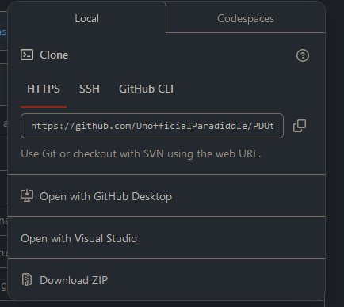
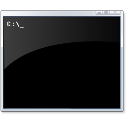

**Paradiddle Utilities**

Utilities and Song Converter for the VR Drumming Game Paradiddle.

## Getting Started
Make sure you have these installed:
- **Python 3**
- **Git** *(Optional)*

### Step 1: 

Go ahead and download the code from this repository. You can either do this by going to the green `Code` button in the top right of the files and clicking Download ZIP

or 

If you are using Git, clone the repository onto your computer with: 

>`git clone https://github.com/UnofficialParadiddle/PDUtility.git`

### Step 2:

  
   
  

Go ahead and open up your terminal of choice. If you are on a Windows system, using `CMD` or `Bash` will be best for this

Next, we need to set the terminal to the location of the PDUtility folder. To do this get the path of the PDUtility folder through the file explorer, and enter `cd path_to_folder` into the terminal

### Step 3:
Now with our terminal set up, all we need to do is install everything thats required for the project to work, which is easily done with putting `python -m pip install -r requirements.txt` into the terminal.

### Step 4:
After all of that, to run the application we just need to enter `python PDUtilities`. Viola!